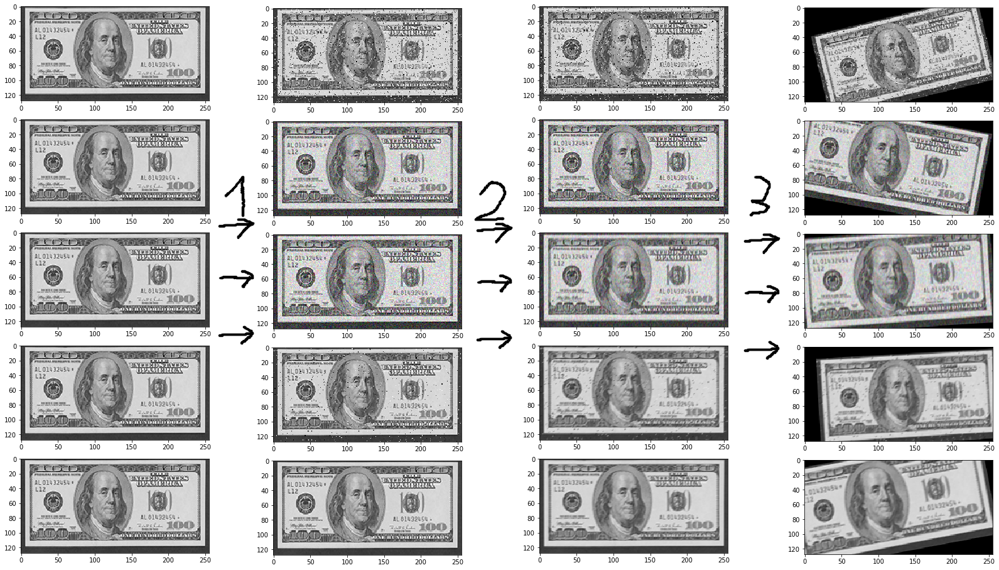
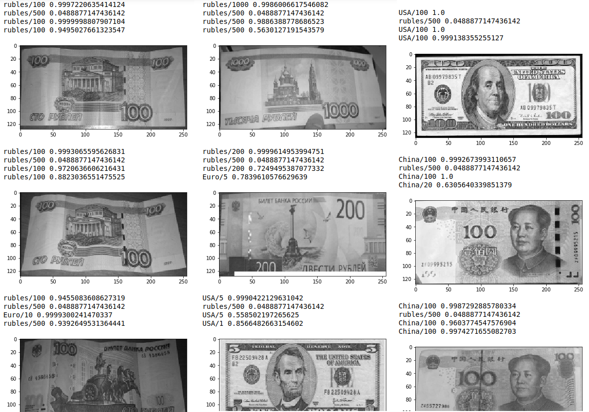

# Money_recognition

An application for money classification.

Now it is trained to classify the following countries banknotes:
1. Russia.
2. USA.
3. EU.
4. China.
5. Kazakhstan.

## Installation
To install the app, you should do the following:
0. If you want, create a new venv.
1. Download following python libs: 
    * tensorflow
    * numpy
    * jupyter notebook
    * imgaug
    * matplotlib
    * PIL(Pillow)
    * scipy
    * ipywidgets
2. Clone this repository.

## Usage

There are 4 pre-trained models, second one doesnt work at all.

Example of usage is shown in ```load_trained.ipynb```.
1. Load models 1-4 from ```training/*``` with ```tf.keras.models.load_model```.
2. Read an image as a numpy array.
3. Convert the image to grayscale, set it's type to np.float32 and make sure it 
every pixel is is in range 0-1(just divide picture pixels by 255).
4. Predict the values with ```model.predict(pic)```.
5. With ```values[np.argmax(predicted_val)]``` get the predicted class of the banknote.

## Algorithm

As the aim was to make the neural networks do as much as it can, it should itself
deal with noises, blurs, even with non-cropped or rotated pics. To make it possible,
we should train the NN on noised, blured, rotated etc pictures. As it is a burden to
collect dataset with many variants of rotations, noises etc, only a perfect primary 
dataset is collected. The training(or secondary) dataset is created with artificial
addition of all the imperfections.

First thing to do was to collect primary dataset. The primary dataset has to be
perfect: no blur, no noise, not rotated, cropped.  

### Secondary dataset generation.

Generation of secondary dataset is based on the primary dataset. 

The secondary dataset generation was done with imgaug.

The following augmentation operations were used at the generation of secondary dataset:
1. Noise generation. 3 types of noise: Gaussian, Poisson, SaltAndPepper. 
Each one of them was applied with 50 percent probability.
2. Blur. 2 types: Gaussian and Motion. One of them was applied with randomized parameters.
3. Affine transformations. Small rescales, moving, rotation were done to each picture.

The examples of the augmentations can be seen on the following pic:



### Training

4 models of CNNs were created with different amounts of convolution kernels and
layers, with or without usage of batch normalisation. For exact architecture you can
see ```neural_network_fit.ipynb```

### Results

Results of 1st and 3d models are similarly good, 4th is a bit less accurate, 2nd model
doesn't work at all.

